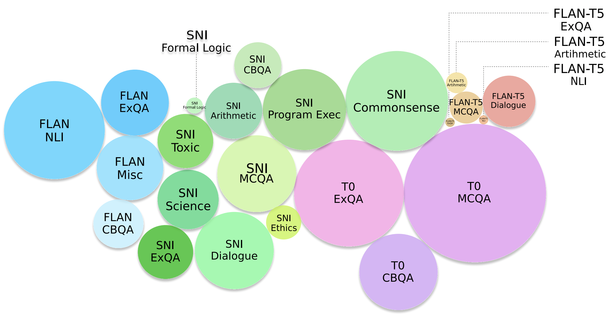

# CoT-Collection
Repository for the paper "The CoT Collection: Improving Zero-shot and Few-shot Learning of Language Models via Chain-of-Thought Fine-Tuning", including 1.88M CoT rationales extracted across 1,060 tasks"

Paper Link : https://arxiv.org/abs/2305.14045

Overview of CoT Collection.
<p align="center">
  
</p>

## Download Dataset
You could use the following google drive link to download CoT Collection.
```
https://drive.google.com/drive/folders/1NoqtRweV6SggEKnDnvJTa-FIvEynkijg?usp=sharing
```
Note that we also provide CoT rationales for 5 languages (Korean, Japanese, Chinese, French, Russian). These files include direct instances without CoT rationales.

We're also planning to upload CoT Collection to huggingface datasets, so stay tuned!

## Code

We'll currently refactoring our code as well! We'll upload it soon:)

## Citation
If you find this useful, please consider citing our paper:
```
@article{kim2023cot,
  title={The CoT Collection: Improving Zero-shot and Few-shot Learning of Language Models via Chain-of-Thought Fine-Tuning},
  author={Kim, Seungone and Joo, Se June and Kim, Doyoung and Jang, Joel and Ye, Seonghyeon and Shin, Jamin and Seo, Minjoon},
  journal={arXiv preprint arXiv:2305.14045},
  year={2023}
}
```  

## Point of contact
For any questions about the implementation or content of the paper, you could contact me via the following email:)
```
seungone@kaist.ac.kr
```
